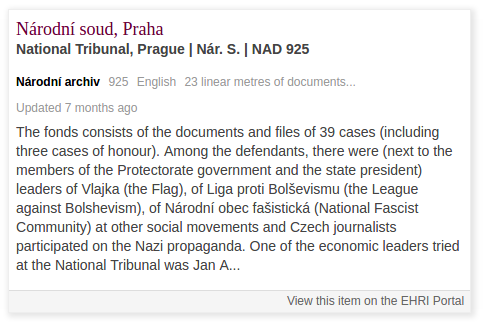
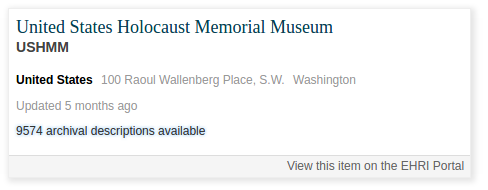
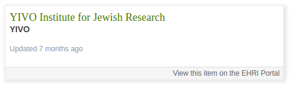
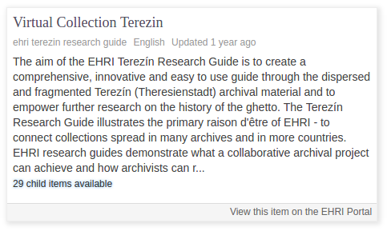

EHRI Wordpress Plugin
=====================

A simple demo plugin to interact with the EHRI portal's version 1 API.

Embeds data from the EHRI portal into a blog post page using the `[ehri-item-data id="SOME-ITEM"]` shortcode.

This will result in the item metadata being rendered like so:

1. [Documentary units](https://portal.ehri-project.eu/units) `[ehri-item-data id="cz-002286-925"]`

   

2. [Institutions](https://portal.ehri-project.eu/institutions) `[ehri-item-data id="us-005578"]`

   

3. [Authorities](https://portal.ehri-project.eu/authorities) `[ehri-item-data id="ehri_cb-004280"]`

   

4. [Virtual Collections](https://portal.ehri-project.eu/virtual) `[ehri-item-data id="wp2-ehri-terezin-research-guide"]`

   

The base URL of the EHRI API endpoint can be changed from the Wordpress settings menu, but defaults to:

   https://portal.ehri-project.eu/api/v1/
